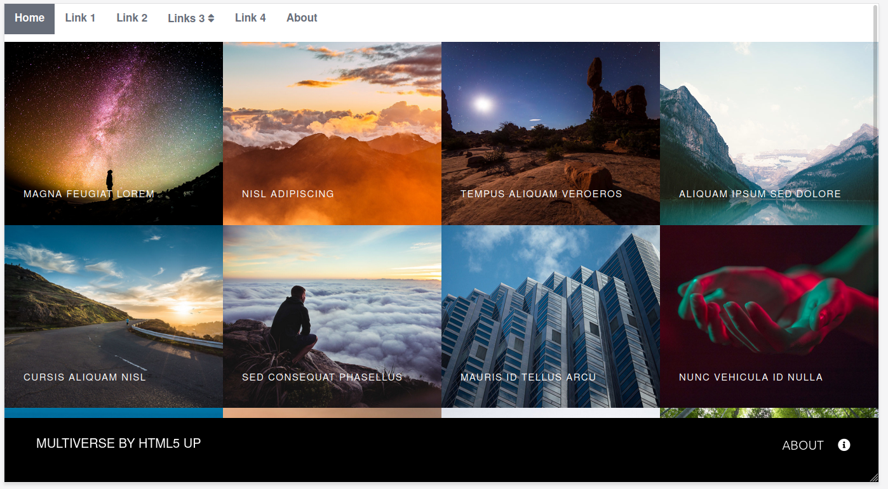
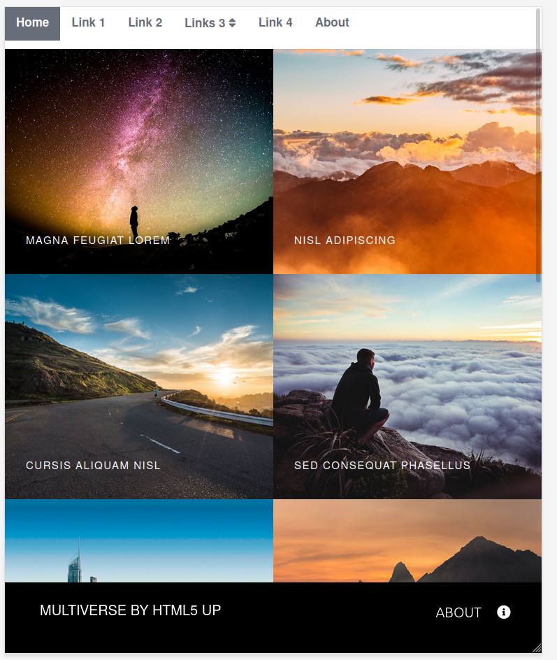
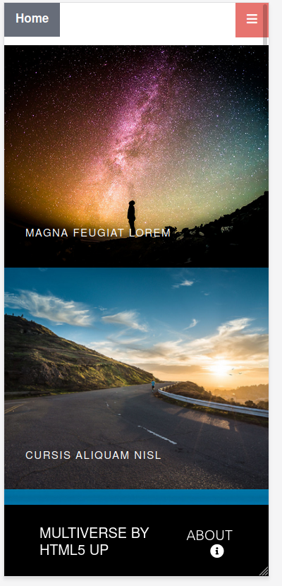

# Multiverse-Layout

Link to the website: [https://test-proj-gda1.web.app/](https://test-proj-gda1.web.app/)

## Description

Project made during Front-End Bootcamp. It consisted in the exact reproduction of a specific page layout. Original layout
website: <https://html5up.net/multiverse>.

It is fully responsive layout: for mobile, tablet and big display. I've added top navigation to the layout.

## ScreenShots

## Built With

- [Lightbox2](https://lokeshdhakar.com/projects/lightbox2/) - Displaying images.

## License

[MIT](https://choosealicense.com/licenses/mit/)
